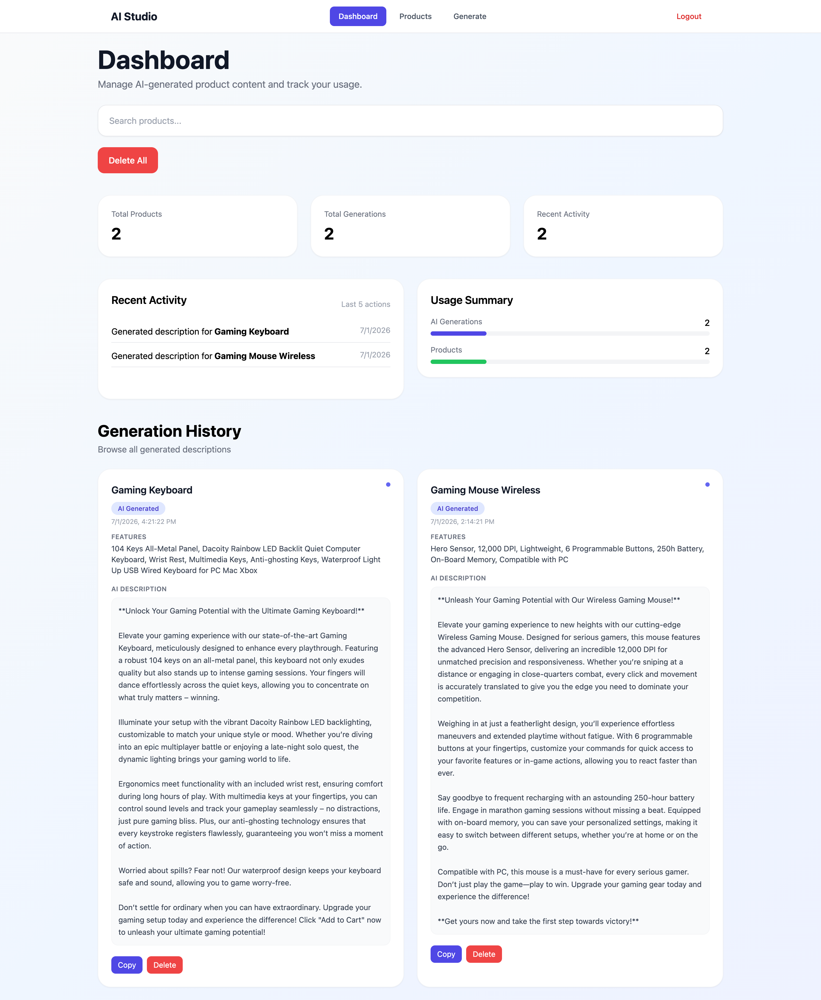
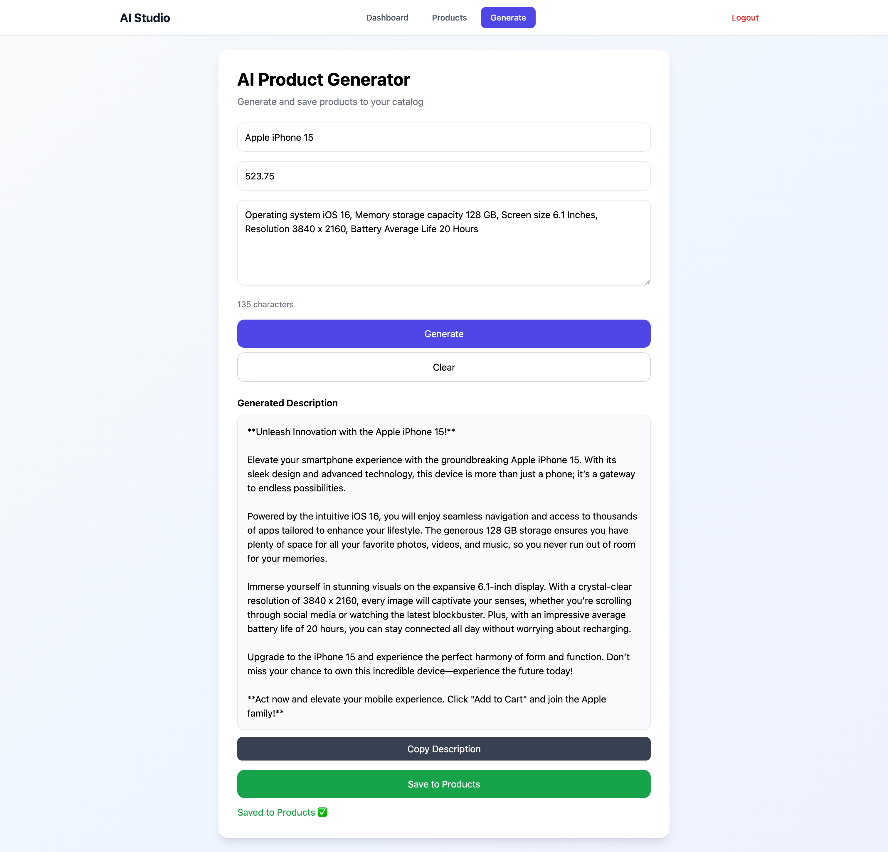
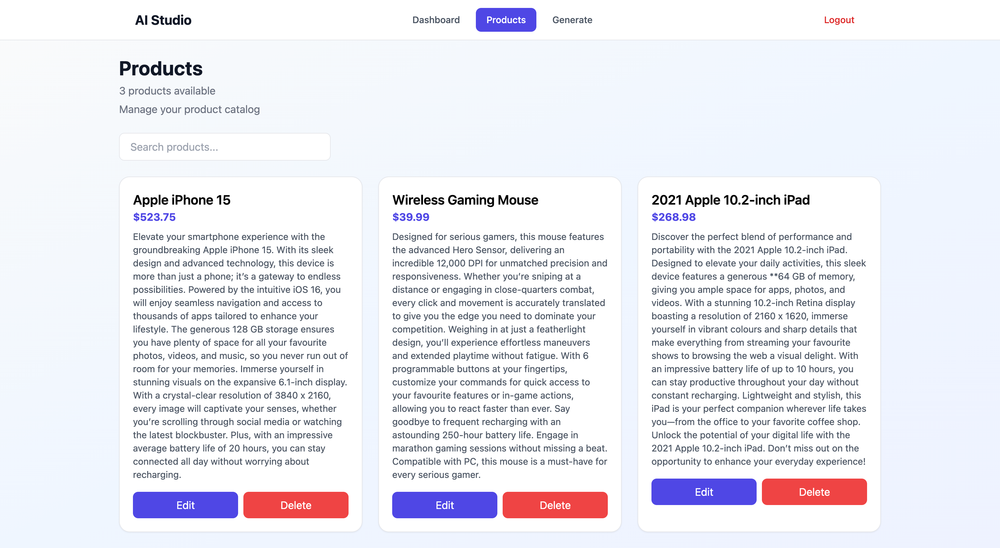
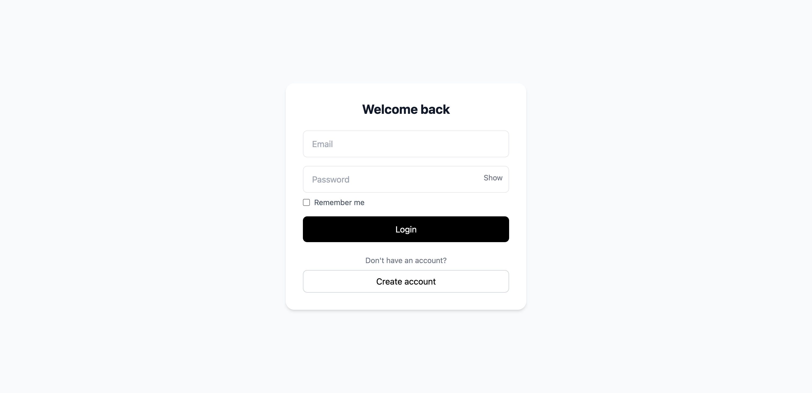
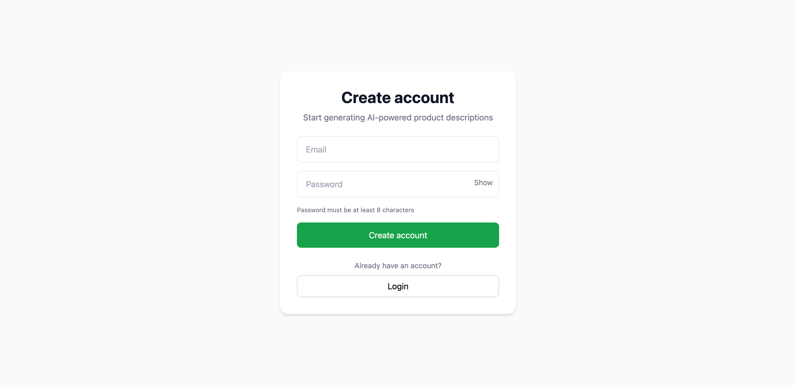

# AI-Product-Studio
# AI Product Studio

An AI-powered full-stack web application that generates product descriptions using AI and manages them in a product dashboard. Built with React, Flask, SQLAlchemy, PostgreSQL/SQLite, and JWT authentication.

## Live Demo

* Frontend Demo: https://ai-product-studio-three.vercel.app/

* Backend API: https://ai-product-studio-qn6v.onrender.com

## Screenshots

### Dashboard



### Product Description Generator



### Products Page



### History Page


### Login Page



### Register Page



## Features

* User authentication with Register/Login and JWT
* AI-powered product description generator
* Save generated content to database
* Full CRUD operations for products
* Generation history dashboard
* Inline product editing with SaaS-style UI
* Delete single history item or all history
* Search history by product name
* Responsive modern UI using Tailwind CSS
* Protected API routes using JWT

## Tech Stack

### Frontend

* React
* React Router
* Tailwind CSS
* Fetch / Axios

### Backend

* Flask
* Flask-JWT-Extended
* Flask-SQLAlchemy
* Flask-CORS
* PostgreSQL / SQLite
* OpenAI API

## Project Structure

```text
frontend/
  src/
    pages/
      Dashboard.jsx
      Products.jsx
      Generate.jsx
      Login.jsx
      Register.jsx
    components/
      Navbar.jsx

backend/
  routes.py
  models.py
  app.py
  ai.py
```

## Environment Variables

Create `.env` files for both frontend and backend.

### Backend `.env`

```env
OPENAI_API_KEY=your_openai_api_key_here
JWT_SECRET_KEY=your_jwt_secret_key_here
DATABASE_URL=sqlite:///store.db
```

### Frontend `.env`

```env
VITE_API_URL=http://127.0.0.1:5000
```

For production, set `VITE_API_URL` to your deployed Render backend URL.

## How to Run

### Backend

```bash
cd backend
python -m venv venv
source venv/bin/activate
pip install -r requirements.txt
python app.py
```

### Frontend

```bash
cd frontend
npm install
npm run dev
```

## Deployment

* Frontend deployed on Vercel
* Backend deployed on Render
* Database hosted with Render PostgreSQL


